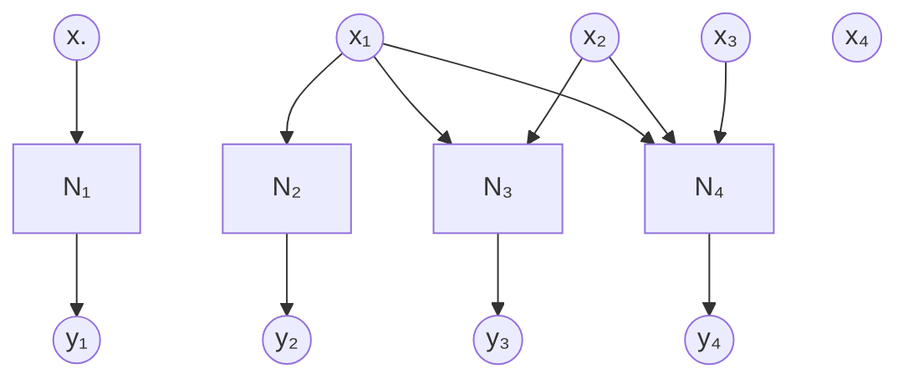

## Introduction##

Autoregressive models as the name implies, generates data by predicting each element sequentially based on the elements previously generated. They are naturally aligned to tasks involving sequential dependence like natural language, audio and time-series data. However, autoregressive models have also been successfully applied to image generation.

- **GPT** (Generative Pre-trained Transformer) is a language model that predicts the next word or token based on previously generated text.
- **PixelCNN and PixelRNN** generate images pixel by pixel, with each pixel depending on the pixels generated before it.
- **WaveNet** produces audio samples one at a time, with each sample conditioned on prior samples, making it suitable for realistic speech and audio synthesis.

## Factorisation of a probability distribution ##

In the autoregressive approach we are either dealing with an ordered sequence (language) or unordered vector samples (images) and in general the data can be thought of as multi-dimensional vectors and their probability distributions are best represented as joint distributions over all these dimensions. A joint distribution over an n-dimensional vector can be stated accurately using the chain rule of probabilities as 

$$
p(x_1, x_2, \dots, x_n) = p(x_n | x_{n-1}, \dots, x_2, x_1) \dots p(x_3 | x_2, x_1) \cdot p(x_2 | x_1) \cdot p(x_1)
$$

The principle behind autoregression is to compute this factorisation sequentially. For large dimensions this factorisation requires an exponentially large number of parameters (number of possible states that the distribution can take, also known as the support of the distribution). A **Bayesian network** is a graphical representation of such a probability distribution and in the unsimplified case above, a fully connected **directed acyclic graph (DAG)** with nodes representing the elements of the vector and the directed edges representing the dependence. 
### Conditional independence in a Bayesian network ###

One way to simplify the computation of the joint distribution is to assume conditional independence - equivalent to removing certain edges from the Bayesian network. The simplest example of this would be a Markov model where an element (or node in a DAG) is independent of every other (historical) element given the immediate previous one

$$
p(x_{i} \perp x_{i-2},\dots,x_2,x_1 | x_{i-1})
$$

and the chain rule factorisation simplifies to 

$$
p(x_1, x_2, \dots, x_n) = p(x_n | x_{n-1}) \dots p(x_3 | x_2) \cdot p(x_2 | x_1) \cdot p(x_1)
$$

A more general Bayesian network would be one where every value is conditionally dependent on a few others ($\ll n$) thereby simplifying the joint distribution to 

$$
p(x_1, x_2, \dots, x_n) = \prod_{i=1}^n p(x_i | \hat{\mathbf{x}_i})
$$

where $\hat{\mathbf{x}_i}$ denotes the subset of elements of $\mathbf{x}$ on which $x_i$ is conditionally dependent. 

### Modelling conditional probabilities using a neural network ###

Another way to simplify the computation is to assume that there exists a computable function that can closely approximate the conditional probabilities. If we are dealing with discrete variables, then this function is a probability mass function (PMF), while if we are dealing with continuous variables then it is the probability density function (PDF). The structure remains the same and for the case of a fully connected network (chain rule factorisation) the implementation can be represented by the figure below where the $N_i$ blocks represent the individual models with each model being progressively more complex than the previous one.

**Fully visible sigmoid belief networks (FVSBN)** use logistic regression for each of the individual models. Results however are not good with this technique for image generation, since logistic regression is not complex enough to capture relationships in the images. 

Using neural networks instead works better as is the case with **neural autoregressive distribution estimator (NADE)** which uses single layer neural networks for each of the models. Unlike logistic regression, a neural network can introduce non-linearities and is therefore much more flexible in learning features and the results are much more impressive. If we use a similar strategy to model a general Bayesian network with conditional independence simplifications it reduces to

$$
p(x_1, x_2, \dots, x_n) = \prod_{i=1}^n p_{neural}(x_i | \hat{\mathbf{x}_i})
$$

???+ info "Universal Approximation Theorem"

    A feedforward neural network with at least one hidden layer and a 
    sufficiently large number of neurons can approximate any continuous function
    to any desired degree of accuracy, provided the network uses a non-linear
    activation function (like a sigmoid or ReLU)

